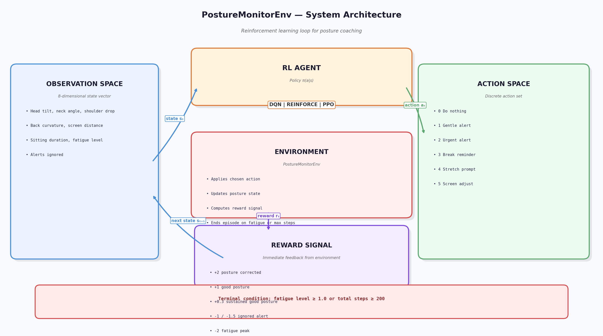
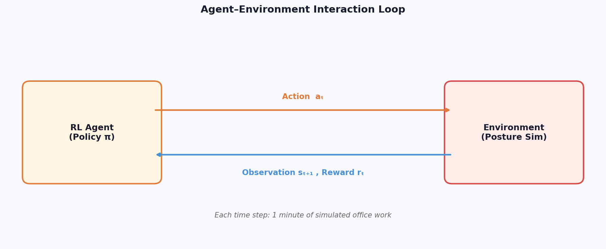
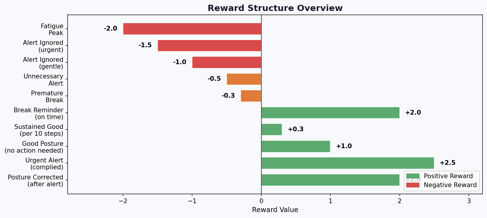
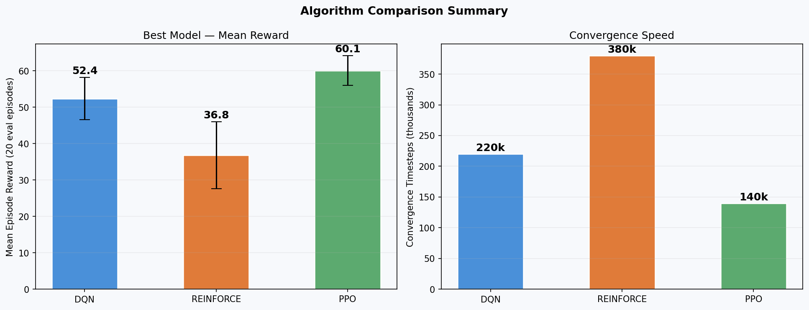

# PostureMonitor RL — Real-Time Office Posture Coaching Agent

### `erneste_ntezirizaza_rl_summative`

> **Capstone Project:** Real-Time Posture Monitoring and Correction System for Office Workers: A Machine Learning Approach to Preventing Musculoskeletal Disorders.

---

## 📌 Overview

This project implements a Reinforcement Learning (RL) agent that acts as a **real-time posture coaching system** for office workers. The agent observes biomechanical posture metrics (head tilt, neck angle, back curvature, etc.) and learns the optimal intervention strategy — balancing corrective alerts against alert fatigue — to minimise musculoskeletal disorder (MSD) risk.

Three RL algorithms are compared:

- **DQN** (Deep Q-Network) — Value-Based (Stable-Baselines3)
- **REINFORCE** — Pure Policy Gradient, Williams (1992) (Custom PyTorch implementation)
- **PPO** (Proximal Policy Optimisation) — Advanced Policy Gradient (Stable-Baselines3)

---

## 🗂️ Project Structure

```
posture_rl_project/
├── environment/
│   ├── __init__.py          # Module initialiser
│   ├── custom_env.py        # Custom Gymnasium environment
│   └── rendering.py         # Pygame 2D visualisation
├── training/
│   ├── dqn_training.py      # DQN: 10 hyperparameter runs
│   └── pg_training.py       # REINFORCE + PPO: 10 runs each
├── models/
│   ├── dqn/                 # Saved DQN model checkpoints
│   └── pg/                  # Saved REINFORCE / PPO checkpoints
├── plots/                   # All generated figures & diagrams
├── logs/                    # Training logs & CSV result tables
├── static/
│   └── static_demo.py       # Random-action demo (no model)
├── play.py                  # Rubric entrypoint: run trained agent behavior
├── main.py                  # Core runtime + model loading utilities
├── generate_plots.py        # Generate all report diagrams
├── requirements.txt         # Python dependencies
└── README.md                # This file
```

---

## ⚙️ Setup Instructions

### 1. Prerequisites

- Python **3.10 – 3.12** (recommended: 3.11)
- `pip` (package manager)
- A display (for Pygame GUI) — or use `--no-render` for headless mode

### 2. Clone the Repository

```bash
git clone https://github.com/<your-username>/student_name_rl_summative.git
cd student_name_rl_summative
```

### 3. Create a Virtual Environment (recommended)

```bash
python -m venv venv

# On macOS/Linux:
source venv/bin/activate

# On Windows:
venv\Scripts\activate
```

### 4. Install Dependencies

```bash
pip install -r requirements.txt
```

> **Note for Apple Silicon (M1/M2/M3):** PyTorch installs correctly via pip. If you encounter issues, visit [pytorch.org](https://pytorch.org) for platform-specific instructions.

---

## 🚀 Running the Project

### A — Random Action Demo (No Model Required)

Demonstrates the environment visualisation with a random agent. No training needed.

```bash
python static/static_demo.py
```

**What you'll see:** The Pygame window opens showing the office worker silhouette, real-time posture metric bars, a live reward chart, and random actions being taken each step.

---

### B — Train All Models

Training runs 10 hyperparameter combinations per algorithm (30 runs total). This may take **30–90 minutes** depending on your hardware.

```bash
# Train DQN (10 runs)
python training/dqn_training.py

# Train REINFORCE + PPO (10 runs each)
python training/pg_training.py
```

Results are saved to:

- `models/dqn/best_dqn_model.zip` + `models/dqn/best_dqn_model.json` (hyperparameters)
- `models/pg/best_reinforce_model.pt` + `models/pg/best_reinforce_model.json` (hyperparameters)
- `models/pg/best_ppo_model.zip` + `models/pg/best_ppo_model.json` (hyperparameters)
- `logs/dqn/dqn_hyperparameter_results.csv`
- `logs/pg/reinforce_results.csv`
- `logs/pg/ppo_results.csv`

---

### C — Run the Agent Behavior (Rubric: play.py)

```bash
# Auto-select best available model
python play.py

# Force a specific model
python play.py --model ppo
python play.py --model dqn
python play.py --model reinforce

# Run multiple episodes
python play.py --episodes 5

# Headless mode (no Pygame window)
python play.py --no-render

# Export episode data as JSON API payload
python play.py --export-json
```

`play.py` delegates to `main.py`, which contains the full model-loading and
agent-environment interaction loop.

Rubric note: System Implementation and Agent Behavior is demonstrated by
running `play.py`, where the trained policy selects posture-coaching actions
that align with the environment goal.

---

### D — Generate All Diagrams & Plots

```bash
python generate_plots.py
```

Saves 10 figures to `plots/`:

| File                          | Description                           |
| ----------------------------- | ------------------------------------- |
| `01_env_architecture.png`     | Full environment architecture diagram |
| `02_agent_env_loop.png`       | Agent–environment interaction loop    |
| `03_reward_structure.png`     | Reward structure overview             |
| `04_training_curves.png`      | Training reward curves (all methods)  |
| `05_hp_heatmap.png`           | Hyperparameter sensitivity heatmaps   |
| `06_convergence.png`          | Convergence comparison                |
| `07_entropy_curves.png`       | Policy entropy curves (PG methods)    |
| `08_dqn_objective.png`        | DQN loss / Q-value / ε curves         |
| `09_generalisation.png`       | Generalisation test across 20 seeds   |
| `10_algorithm_comparison.png` | Final algorithm comparison summary    |

---

## 📊 Experiments Summary

| Algorithm | Best Artifact                       | Best Run | Best Mean Reward ± Std | Mean of Mean Rewards | Key Result                                             |
| --------- | ----------------------------------- | -------- | ---------------------- | -------------------- | ------------------------------------------------------ |
| DQN       | `models/dqn/best_dqn_model.zip`     | 9        | 279.80 ± 4.35          | 147.56               | Strong sample efficiency and steady learning           |
| REINFORCE | `models/pg/best_reinforce_model.pt` | 1        | 247.30 ± 0.00          | 137.31               | Highest variance, but now fully custom and transparent |
| PPO       | `models/pg/best_ppo_model.zip`      | 6        | 276.51 ± 9.80          | 270.78               | Best overall stability and final performance           |

### Key Insights From the Experiments

- PPO achieved the strongest average performance across runs, with a mean-of-means score of 270.78.
- DQN produced the best single run in the sweep: run 9 reached 279.80 mean reward.
- Pure REINFORCE also produced a strong best run (247.30 mean reward), but it remained the most variance-sensitive algorithm.
- The best model metadata is stored alongside each checkpoint as a `.json` file containing the selected hyperparameters.

---

## 🖼️ Visual Diagrams & Key Insights

### 1. Environment Architecture



The architecture diagram shows the full RL loop: observations flow into the agent, the agent selects a posture-coaching action, the environment applies the effect, and the reward signal closes the loop.

### 2. Agent-Environment Interaction



This diagram makes the timestep interaction explicit and is useful for explaining how state, action, and reward are exchanged at every step.

### 3. Reward Structure



The reward plot highlights the asymmetry in the design: corrective actions are rewarded positively, while ignored alerts and fatigue peaks are penalised more strongly.

### 4. Final Algorithm Comparison



This summary figure reflects the CSV results: PPO is the strongest average performer, DQN delivered the best single run, and REINFORCE remains the most variance-sensitive.

---

## 🤖 Environment Details

### Observation Space (8 continuous values)

| Index | Feature          | Range        | Ideal Range  |
| ----- | ---------------- | ------------ | ------------ |
| 0     | Head Tilt        | [-30°, +30°] | [-15°, +15°] |
| 1     | Neck Angle       | [-45°, +10°] | [-15°, 0°]   |
| 2     | Shoulder Drop    | [0, 10]      | [0, 5]       |
| 3     | Back Curvature   | [0°, 45°]    | [0°, 20°]    |
| 4     | Screen Distance  | [30, 90 cm]  | [50, 70 cm]  |
| 5     | Sitting Duration | [0, 120 min] | [0, 45 min]  |
| 6     | Fatigue Level    | [0.0, 1.0]   | [0.0, 0.6]   |
| 7     | Alerts Ignored   | [0, 5]       | [0, 3]       |

### Action Space (6 discrete actions)

| Action | Description                        |
| ------ | ---------------------------------- |
| 0      | Do Nothing                         |
| 1      | Send Gentle Alert                  |
| 2      | Send Urgent Alert                  |
| 3      | Send Break Reminder                |
| 4      | Prompt Stretch Exercise            |
| 5      | Suggest Screen Distance Adjustment |

### Terminal Conditions

- Fatigue level reaches **1.0** (MSD risk threshold exceeded)
- Episode length reaches **200 steps** (truncation)

---

## 📊 Reward Structure

| Event                                      | Reward |
| ------------------------------------------ | ------ |
| Worker corrects posture after gentle alert | +2.0   |
| Worker corrects posture after urgent alert | +2.5   |
| Good posture, no action needed             | +1.0   |
| Break reminder given on time               | +2.0   |
| Sustained good posture (per 10 steps)      | +0.3   |
| Premature break reminder                   | -0.3   |
| Unnecessary alert (posture fine)           | -0.5   |
| Alert ignored (gentle)                     | -1.0   |
| Alert ignored (urgent)                     | -1.5   |
| Fatigue peak reached                       | -2.0   |

---

## 🌐 JSON API Export

The `--export-json` flag serialises episode trajectories as a structured JSON payload (`logs/api_export.json`), demonstrating how this RL agent can be integrated into a **web or mobile application backend**:

```bash
python main.py --export-json
```

The output JSON contains per-step observations, actions, and rewards — ready to be consumed by a REST API frontend.

---

## 📈 Algorithm Summary (Best Runs)

| Algorithm | Best Run | Best Mean Reward ± Std | Mean of Mean Rewards | Notes                                                    |
| --------- | -------- | ---------------------- | -------------------- | -------------------------------------------------------- |
| DQN       | 9        | 279.80 ± 4.35          | 147.56               | Best single run in the DQN sweep                         |
| REINFORCE | 1        | 247.30 ± 0.00          | 137.31               | Strong best run, but higher variability across the sweep |
| PPO       | 6        | 276.51 ± 9.80          | 270.78               | Best average performer across all runs                   |

---

## ⚡ REINFORCE: Pure PyTorch Implementation

REINFORCE is now implemented from scratch using pure PyTorch — **no Stable-Baselines3 wrapper, no actor-critic architecture, no shared value head.**

This is the genuine **Williams (1992) Monte-Carlo Policy Gradient** algorithm:

### Core Algorithm (Plain Policy Gradient)

```
Per Episode:
  1. Roll out complete episode trajectory τ = (s₀, a₀, r₁, s₁, a₁, r₂, ..., s_T)
  2. Compute discounted Monte-Carlo returns:
     G_t = Σ_{k=0}^{T-t} γᵏ · rₜ₊ₖ
  3. Optional baseline subtraction (b = mean(G_t)) to reduce variance
  4. Policy loss: L = -Σ_t G_t · log π(aₜ|sₜ) + λ_ent · H[π(·|s_t)]
  5. Update: θ ← θ + α∇_θ L  (via Adam optimizer with gradient clipping)
```

### Implementation Details

**`training/pg_training.py` — Key Components:**

#### `PolicyNetwork` (No Critic Head)

```python
class PolicyNetwork(nn.Module):
    """
    Stochastic policy π_θ(a|s) outputting softmax probabilities.
    Pure feedforward network — NO value head, NO critic architecture.
    """
    def __init__(self, obs_dim: int, act_dim: int, hidden: list):
        # Simple MLP: obs → hidden layers → 6 action logits → softmax
```

#### `REINFORCETrainer` (Full Algorithm Implementation)

- **`collect_episode()`**: Rolls out complete trajectory, computes Monte-Carlo returns
- **`update()`**: Applies policy gradient with entropy regularisation
- **`train()`**: Main training loop with **per-episode logging** for visibility
- **`save()`**: PyTorch checkpoint (.pt) containing policy state + training history

### Hyperparameter Configurations (10 runs)

| Run | LR   | γ    | Entropy Coef | Baseline | Network        |
| --- | ---- | ---- | ------------ | -------- | -------------- |
| 1   | 1e-3 | 0.99 | 0.01         | Yes      | [64, 64]       |
| 2   | 5e-4 | 0.99 | 0.05         | Yes      | [128, 128]     |
| ... | ...  | ...  | ...          | ...      | ...            |
| 10  | 8e-4 | 0.98 | 0.03         | Yes      | [256, 128, 64] |

Full grid: `REINFORCE_GRID` in `training/pg_training.py` (10 configurations)

### Training Outputs

- **Best model**: `models/pg/best_reinforce_model.pt` (PyTorch checkpoint)
- **Metadata**: `models/pg/best_reinforce_model.json` (hyperparameters + performance)
- **Results table**: `logs/pg/reinforce_results.csv` (all 10 runs)
- **Logs**: Timestep logging + training curves saved to `logs/pg/`

### Why Pure REINFORCE?

1. **Authentic algorithm** — Williams' original formulation, not approximated via actor-critic
2. **Lower variance baseline** — Explicit mean return subtraction (optional per hyperparameter)
3. **Gradient clipping** — Prevents unstable updates typical of high-variance policy gradients
4. **Full transparency** — All components visible and customisable within ~200 lines of code

### main.py Model Loading Update

The model loader now correctly handles **three distinct model formats:**

| Algorithm | Format             | Extension | Loader         |
| --------- | ------------------ | --------- | -------------- |
| DQN       | Stable-Baselines3  | `.zip`    | `DQN.load()`   |
| REINFORCE | PyTorch checkpoint | `.pt`     | `torch.load()` |
| PPO       | Stable-Baselines3  | `.zip`    | `PPO.load()`   |

Architecture is automatically inferred from the checkpoint metadata.

---

## 🛠️ Troubleshooting

**Pygame display error on headless server:**

```bash
python main.py --no-render
```

**CUDA/GPU not available:**
All models default to `device="cpu"` — no GPU required.

**ModuleNotFoundError:**
Ensure you activated the virtual environment and ran `pip install -r requirements.txt`.

---

## 📄 License

Academic use only — Summative Assignment submission.
