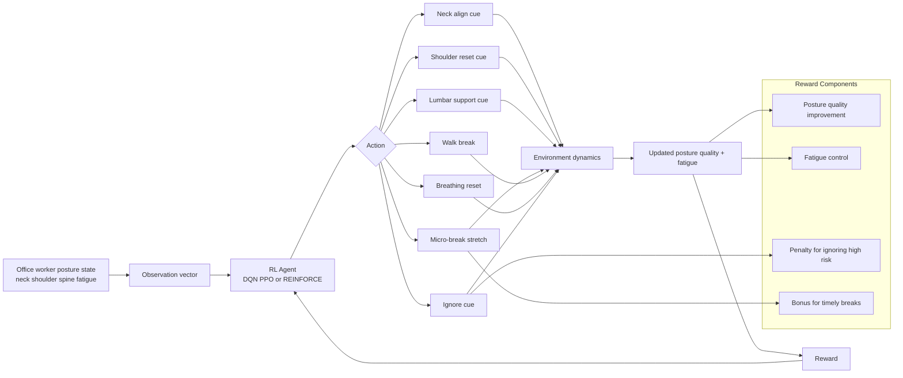

# Agent-Environment Diagram

This diagram summarizes how the reinforcement learning agent interacts with the posture correction mission environment.

## Description

- State: a continuous representation of neck alignment quality, shoulder symmetry quality, spinal support quality, fatigue, time at desk, and recent trend.
- Action: the agent chooses one ergonomic intervention at each step.
- Transition: posture naturally drifts due to fatigue and static sitting; actions counter this drift with varying strengths.
- Reward: shaped to encourage stable posture improvement, prevent fatigue escalation, and use breaks at the right time.
- Goal: maximize cumulative ergonomic score while completing a work session without severe posture degradation.
